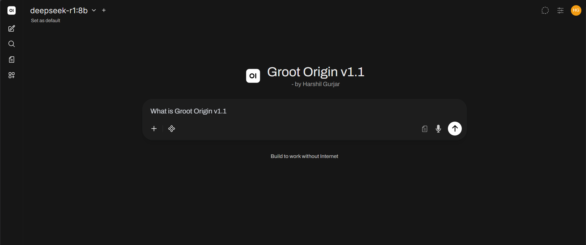
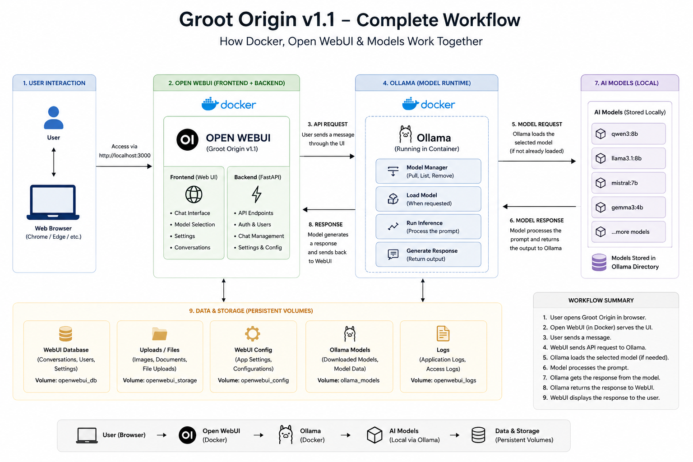
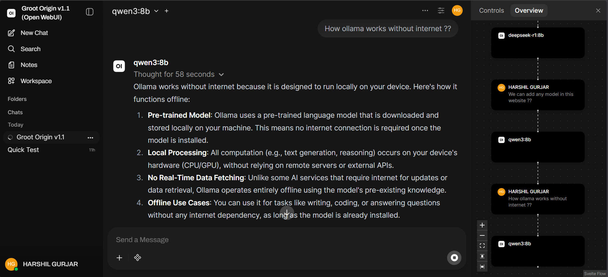
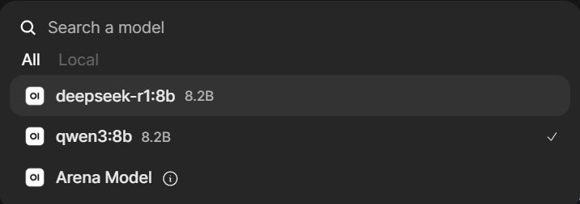
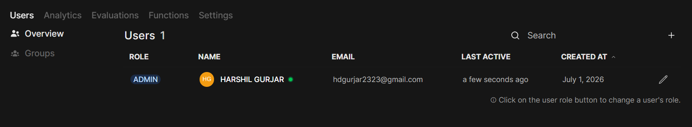
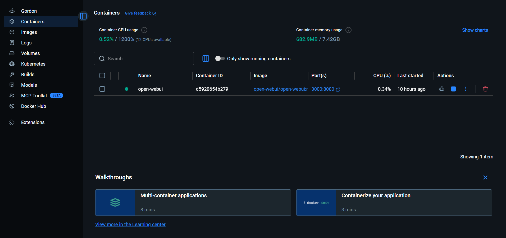

<div align="center">

# 🌳 Groot Origin v1.1

### Your Personal Offline AI Workspace

Build • Chat • Generate • Think — Completely Offline.




</div>

---

### 🚀 Overview

**Groot Origin v1.1** is a completely **offline AI workspace** built using **Open WebUI**, **Ollama**, and **Docker**. It provides a modern ChatGPT-like experience while keeping your conversations, files, and AI models entirely on your own machine.

Unlike cloud AI platforms, Groot Origin gives users full control over their AI environment without requiring internet connectivity or paid API subscriptions.

---

### ✨ Key Features

- 🤖 Run Local Large Language Models (LLMs)
- 💬 Modern ChatGPT-like User Interface
- 🔒 Complete Offline Privacy
- ⚡ Fast Local Inference
- 🐳 Docker-based Deployment
- 🧠 Ollama Model Management
- 🎨 Image Generation Support
- 📁 File Upload Support
- 🌐 Web Search Integration
- 📚 Chat History Management
- 👥 Multiple Model Support
- 🛠 Easy Customization

---

### 🏗️ Tech Stack

| Technology | Purpose |
|------------|----------|
| Open WebUI | Frontend Interface |
| Ollama | Local LLM Runtime |
| Docker Desktop | Containerization |
| HTML | Structure |
| CSS | Styling |
| JavaScript | Frontend Logic |
| Local AI Models | AI Processing |

---

### 🔄 System Workflow

The following diagram illustrates how Groot Origin processes every user request.

<p align="center">

</p>

### Workflow

```
User
   │
   ▼
Browser (Open WebUI)
   │
   ▼
Docker Container
   │
   ▼
Open WebUI Backend
   │
   ▼
Ollama
   │
   ▼
Local AI Model
   │
   ▼
Generated Response
```

---

### 📂 Project Structure

```
GROOT ORIGIN V1.1
│
├── _DataURI/
│
├── localhost3000/
│   ├── _app/
│   ├── api/
│   ├── assets/
│   ├── generated/
│   ├── node_modules/
│   ├── src/
│   ├── static/
│   ├── index.html
│   └── manifest.json
│
├── assets/
│   ├── Admin.png
│   ├── Chat example.png
│   ├── Docker.png
│   ├── Flowchart.png
│   ├── Initial First Impression.png
│   ├── Model.png
│   └── User's Model.png
│
└── README.md
```

---

### ⚙️ Installation

### 1️⃣ Clone the Repository

```bash
git clone https://github.com/HarshilxAI/Groot-Origin-v1.1.git
```

```bash
cd Groot-Origin-v1.1
```

### 2️⃣ Install Docker Desktop

Download and install Docker Desktop.

### 3️⃣ Install Ollama

Install Ollama from the official website.

Pull your preferred model.

Example:

```bash
ollama pull llama3
```

### 4️⃣ Start Open WebUI

Run using Docker.

```bash
docker compose up
```

or

```bash
docker run ...
```

(depending on your setup)

### 5️⃣ Open the Application

```
http://localhost:3000
```

---

### 📸 Project Showcase

### 🏠 Initial Interface

<p align="center">

</p>

---

### 💬 Chat Interface

<p align="center">

</p>

---

### 🤖 Available AI Models

<p align="center">

</p>

---

### 👤 User Installed Models

<p align="center">

</p>

---

### ⚙️ Admin Dashboard

<p align="center">

</p>

---

### 🐳 Docker Integration

<p align="center">

</p>

---

### 🔄 Complete Workflow

<p align="center">

</p>

---

### 🎯 Why Groot Origin?

✅ Completely Offline

✅ No API Costs

✅ Privacy First

✅ Local AI Models

✅ ChatGPT-like Experience

✅ Docker Powered

✅ Highly Customizable

✅ Fast Response Time

---

### 🚀 Future Roadmap

- [x] Offline AI Workspace
- [x] Open WebUI Integration
- [x] Docker Deployment
- [x] Ollama Support
- [x] Custom Branding
- [ ] Voice Assistant
- [ ] Multi-Agent System
- [ ] RAG Pipeline
- [ ] PDF Intelligence
- [ ] Persistent Memory
- [ ] Cloud Sync (Optional)
- [ ] Mobile Companion

---

### 🤝 Contributing

Contributions are welcome!

If you'd like to improve Groot Origin, feel free to fork the repository, create a feature branch, and submit a pull request.

---

### ⭐ Support the Project

If you found this project useful,

please consider giving it a **⭐ Star** on GitHub.

It really helps the project reach more developers.

---

<div align="center">

### 🌳 Groot Origin v1.1

</div>
